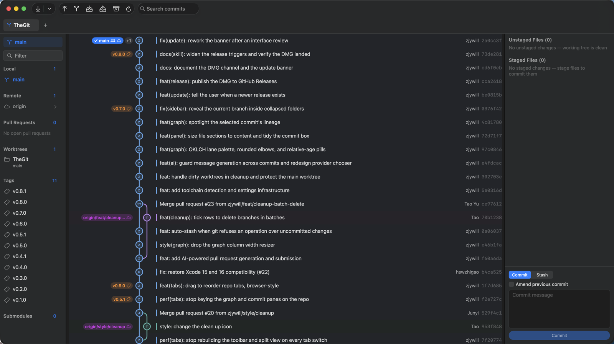

<div align="center">


# TheGit

**A native Git client for macOS that doesn't ship a browser.**

14 MB. One process. ~95 MB of RAM with a repository open.<br>
No account, no telemetry, no sign-in wall.

[](https://github.com/zjywill/TheGit/releases/latest)
[](https://github.com/zjywill/TheGit/releases)
[](#requirements)
[](Sources/TheGit)
[](LICENSE)

</div>



## Get it

```bash
brew install --cask zjywill/tap/thegit
```

Or [**download the DMG**](https://github.com/zjywill/TheGit/releases/latest) —
universal, no toolchain needed. Signed with an Apple Developer ID and notarised
by Apple, so it just opens. [Install details](#install) are below.

---

## Why it's 45× smaller

The mainstream desktop clients ship a browser to draw a commit graph.
GitKraken is an Electron app: Chromium, Node, and a fleet of helper processes,
all resident before it has read a single commit.

TheGit is a single native SwiftUI process that shells out to `git`. That's the
whole architecture, and it's the whole performance story.

| | TheGit | GitKraken |
|---|---:|---:|
| Application bundle | **14 MB** (universal) | 621 MB |
| Release DMG | **4.9 MB** | — |
| Processes at rest | **1** | 7+ |
| Resident memory, repo open | **~95 MB** | ~1.6 GB |
| Chromium bundled | none | 261 MB |

Where that shows up in use:

- **Launch is instant** — no Chromium bootstrap, no splash screen.
- **Nothing indexes in the background** — an FSEvents watcher decides when
  state actually changed, instead of a timer polling every repo you ever opened.
- **The graph is laid out in Swift, not in a DOM** — one pass over the commit
  list ([`Core/GraphLayout.swift`](Sources/TheGit/Core/GraphLayout.swift)),
  drawn with SwiftUI shapes.
- **Scrolling and zoom are AppKit's** — five zoom levels relayout natively
  instead of scaling a web view.

It drives the `git` binary you already have. No embedded Git engine, no daemon,
no service in the middle: your credential helper, SSH keys and hooks work
exactly as they do in the terminal.

The trade is deliberate — TheGit is macOS-only and does exactly what `git`
does. It won't grow a cross-platform UI toolkit or a built-in issue tracker.

> Measured on macOS 26.5 / Apple M4 Pro with one mid-size repository open;
> GitKraken's figures are summed across all its processes. Measure your own
> with Activity Monitor.

---

## What you get

🌳 **A commit graph you can read.** Branch lines carry their own color rather
than inheriting a lane's, so a branch stays one color for its whole life even
when lanes get reused. Uncommitted work shows up as a dashed WIP node at the
top, connected to HEAD.

🪟 **Three panes, one screen.** Branches left, graph middle, staging right.
Click a file and the diff overlays the graph instead of shoving the panes
around; <kbd>Esc</kbd> goes back.

📚 **Everything in the sidebar.** Local and remote branches in a foldable tree
with the current branch pinned on top, plus Tags, Stashes, Worktrees,
Submodules, Git LFS, and — if `gh` or `glab` is logged in — your open
Pull/Merge Requests.

✅ **Staging that matches how you work.** Stage or unstage per file or all at
once, discard, ignore (repo-wide or `.git/info/exclude`), stash just the staged
or just the unstaged, create a patch from a file's changes, amend.

🔀 **Branch operations without the man page.** Merge, rebase, cherry-pick,
revert, reset, fast-forward, tag, push/pull/fetch, set upstream, create a
worktree — from the context menus. When a merge or rebase stops on a conflict,
you get Continue and Abort plus "take ours / take theirs" per file.

🧹 **Cleanup.** Finds branches whose PR is merged, branches squash-merged into
the default branch, branches whose upstream is gone, and stale worktrees —
counts the commits that would be lost, and deletes nothing until you click.

🤖 **AI commit messages** *(optional, off by default)*. Point it at any
OpenAI- or Anthropic-compatible provider and **Generate** turns your staged
diff into a commit message — Conventional Commits or a plain summary, in
English, Chinese, or whatever the repo already uses. The API key goes in the
login keychain, never UserDefaults.

👀 **It notices changes made elsewhere.** Commit, checkout or edit from a
terminal and the view refreshes itself.

🗂️ **Multiple repositories in tabs**, and five UI zoom levels
(<kbd>⌘=</kbd> / <kbd>⌘-</kbd> / <kbd>⌘0</kbd>).

---

## Privacy

TheGit talks to exactly two things by default: the `git` binary and your
filesystem. Three features can reach the network, and you control all three:

| Feature | Reaches | Default |
|---|---|---|
| Author avatars | Gravatar, GitHub | **Off** — View menu |
| AI commit messages | the provider you configured | **Off** — Settings |
| Update check | `api.github.com`, once per launch | On — one request, no identifiers |

Pull request listing uses the `gh` / `glab` CLI you already authenticated;
TheGit never handles those tokens itself.

---

## Install

### Homebrew (recommended)

```bash
brew install --cask zjywill/tap/thegit
```

A cask, so it installs the same signed universal `.app` the DMG carries,
straight into `/Applications` — no Xcode toolchain, no copying it there
yourself.

It used to be a formula that built from source, and that had a cost worth
naming: Homebrew's build environment can't reach the login keychain, so the
Developer ID certificate wasn't there and the bundle came out ad-hoc signed.
An ad-hoc bundle gets a fresh identity on every rebuild, and macOS keys
keychain items to the identity that stored them — so every upgrade asked for
your AI API key again. The cask ships one stable signature, and the prompt
happens once.

Coming from the old formula, once:

```bash
brew uninstall thegit && brew install --cask zjywill/tap/thegit
```

Already dragged TheGit into `/Applications` from a DMG? A cask won't install
over a copy Homebrew didn't put there — it stops with *"It seems there is
already an App at '/Applications/TheGit.app'"*. Hand that copy over:

```bash
brew install --cask --force zjywill/tap/thegit
```

(`--adopt` is the gentler flag, but it only accepts a copy that's already the
same version; `--force` replaces whatever is sitting there.)

### DMG

Every release ships a universal `.dmg` on the
[Releases page](https://github.com/zjywill/TheGit/releases/latest) — no
toolchain, no Homebrew.

Signed with an Apple Developer ID and notarised by Apple, with the ticket
stapled to both the image and the app inside it. Open it, drag TheGit to
Applications, launch it. No Gatekeeper detour, and none even on a Mac that's
offline — the stapled ticket is what makes that true, which is why it's
checked before a release is tagged.

### Upgrade

TheGit tells you when a new release exists: it asks GitHub at launch (at most
every six hours) and shows a one-line banner if there's a newer version. It
never downloads or installs anything by itself — the banner links to the
release page, and dismissing it silences that version for good.
**Check for Updates…** in the TheGit menu asks on demand.

```bash
brew update && brew upgrade --cask thegit
```

Quit TheGit first — a running app keeps its old bundle. `brew update` must
report "Updated 1 tap"; "Already up-to-date" means the tap never moved.

<details>
<summary><b>Let an AI agent install it for you</b></summary>

Using Claude Code, Codex, or any agent with a terminal? Paste this:

```text
Install TheGit (https://github.com/zjywill/TheGit), a native macOS Git
client, on this Mac via Homebrew:

1. brew install --cask zjywill/tap/thegit
   — a cask, so it puts the signed .app straight into /Applications; if
   Homebrew says the tap is untrusted, run: brew trust --cask zjywill/tap/thegit
   — if it stops with "there is already an App at /Applications/TheGit.app",
   that's an older copy dragged from a DMG: rerun with --cask --force
2. Verify: brew list --cask --versions thegit, then open /Applications/TheGit.app

If it's already installed, upgrade instead: quit TheGit, then run
brew update && brew upgrade --cask thegit
If it was installed with the old build-from-source formula, migrate once:
brew uninstall thegit && brew install --cask zjywill/tap/thegit
```

</details>

<details>
<summary><b>Homebrew tap trust, versions, uninstall</b></summary>

Homebrew 6 asks you to trust third-party taps. Installing by full name records
that trust; if a later command says the tap is being ignored:

```bash
brew trust --cask zjywill/tap/thegit
```

Which version you're on:

```bash
brew list --cask --versions thegit
```

Uninstall:

```bash
brew uninstall --cask thegit && brew untap zjywill/tap
```

The app in `/Applications` goes with it — it's the cask's only artifact, so
there's nothing left to `rm` by hand. Your settings survive an upgrade and an
uninstall alike; to take those too:

```bash
brew uninstall --zap --cask thegit
```

`--zap` adds the `com.zjywill.TheGit` `defaults` domain and the saved window
state. The API key in the login keychain outlives both — delete it in
Keychain Access for a genuinely clean slate.

</details>

---

## Requirements

- macOS 14 (Sonoma) or later
- `git` on your `PATH`
- Xcode 15+ / Swift 5.9 toolchain **to build** (not needed for the DMG)
- Optional: `git-lfs`, and `gh` or `glab` for pull requests

<details>
<summary><b>Build it yourself</b></summary>

```bash
scripts/bundle.sh     # universal dist/TheGit.app + dist/TheGit-<version>.dmg
swift run             # run from source
swift test            # tests
```

Useful knobs: `UNIVERSAL=0` builds for this Mac only, `DMG=0` assembles the
`.app` and stops, `DEST=…` picks the output directory. The bundle is **ad-hoc
signed** — enough to run on your own Mac and on any Mac you copy it to by
hand, not enough for network distribution, where Gatekeeper wants a Developer
ID and notarisation.

**Project layout**

```
Sources/TheGit/
  Core/        git invocation, parsers, graph layout, LFS, forge CLIs, AI
  State/       AppState (open repos) and RepoState (one repository)
  UI/          sidebar, graph, diffs, commit panel, settings
Tests/         parser, graph, cleanup and repo integration tests
scripts/       bundle.sh (app + DMG), release.sh (tag + release + tap),
               make-icon.py, sync-providers.py
```

The AI provider catalog in `Sources/TheGit/Resources/providers.json` is
generated and committed; `scripts/sync-providers.py` regenerates it and is only
run to refresh the list.

</details>

---

## License

[MIT](LICENSE) © 2026 Junyi Zhang
